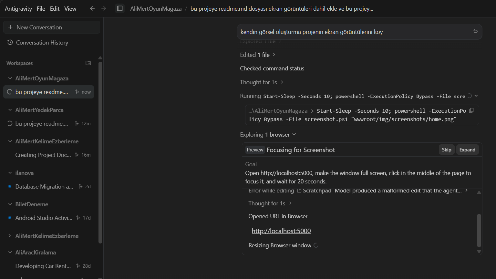

# GameStore - AliMertOyunMagaza

Modern ve kullanıcı dostu bir oyun mağazası web uygulaması. Bu proje, ASP.NET Core MVC mimarisi kullanılarak geliştirilmiştir ve oyun yönetimi, kullanıcı etkileşimi ve raporlama gibi temel özellikleri içerir.

## 🚀 Özellikler

- **Gelişmiş Oyun Kataloğu**: Oyunları kategorilerine göre filtreleyebilir ve detaylarını inceleyebilirsiniz.
- **Admin Paneli & İstatistikler**: Oyun ve kategori yönetimi ile grafiksel istatistik takibi.
- **İstek Listesi (Wishlist)**: Beğendiğiniz oyunları daha sonra incelemek üzere listenize ekleyin.
- **Dinamik Tema**: Göz yormayan karanlık mod ve klasik aydınlık mod seçeneği.
- **Excel & PDF Dışa Aktarma**: İstek listelerini ve oyun verilerini Excel veya PDF formatında indirebilme.
- **Güvenli Kimlik Doğrulama**: ASP.NET Core Identity ile güvenli kayıt ve giriş sistemi.

## 🛠️ Kullanılan Teknolojiler

- **Backend**: ASP.NET Core MVC (.NET 8.0)
- **Veritabanı**: Entity Framework Core & SQL Server
- **UI/UX**: Bootstrap 5, Bootstrap Icons, Custom CSS
- **Raporlama**: QuestPDF
- **Kimlik Yönetimi**: ASP.NET Core Identity

## 📸 Ekran Görüntüleri

| Ana Sayfa | Oyun Kataloğu |
| :---: | :---: |
|  |  |

| Admin Paneli | İstek Listesi |
| :---: | :---: |
|  |  |

## ⚙️ Kurulum

1. Projeyi bilgisayarınıza klonlayın.
2. `appsettings.json` dosyasındaki `DefaultConnection` dizesini kendi veritabanı ayarlarınıza göre güncelleyin.
3. Paketleri geri yükleyin: `dotnet restore`
4. Veritabanını güncelleyin: `dotnet ef database update`
5. Projeyi çalıştırın: `dotnet run`

---
*Bu proje, Ali Mert tarafından eğitim amaçlı geliştirilmiştir.*
